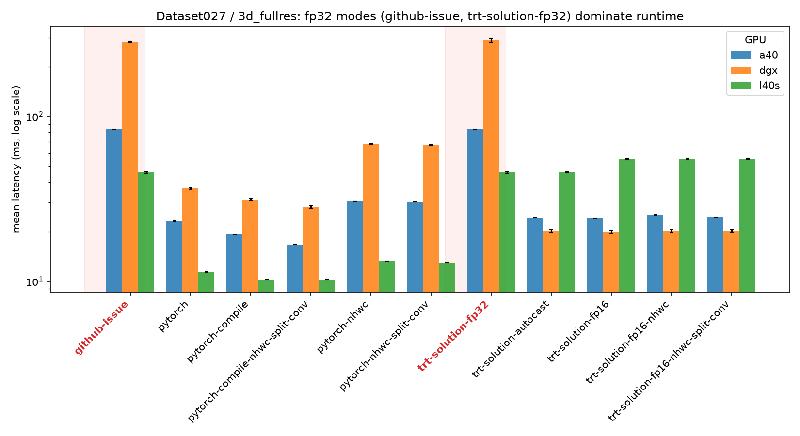
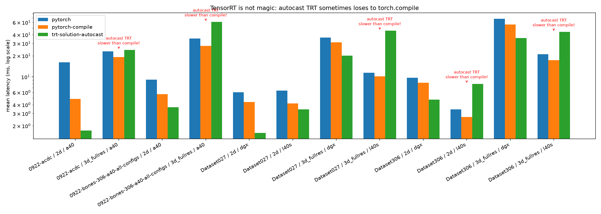
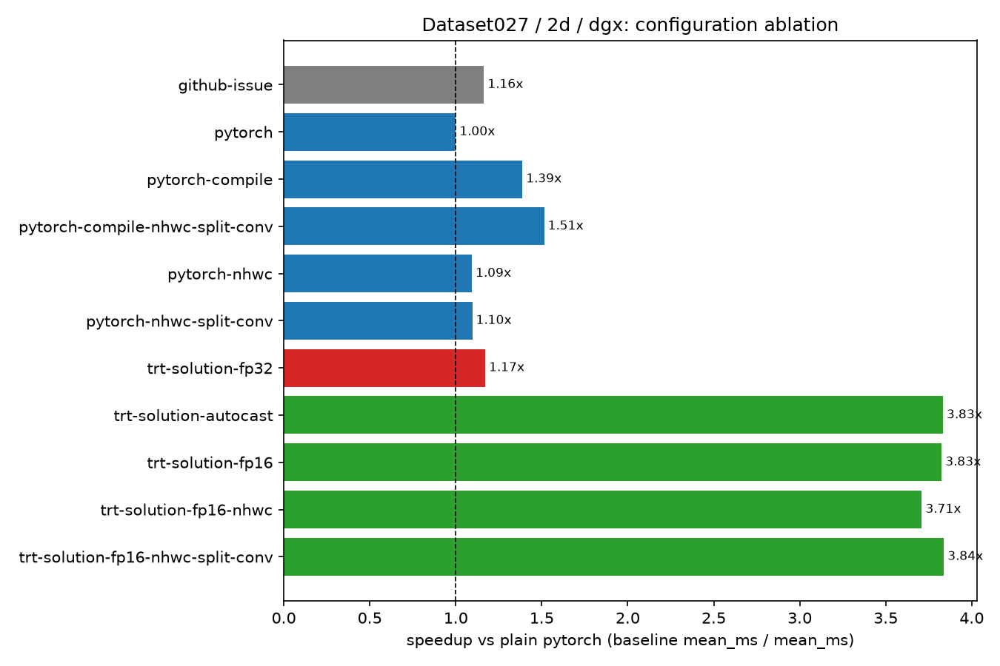
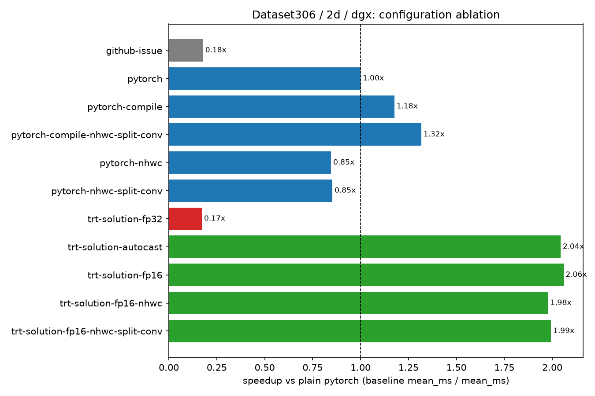
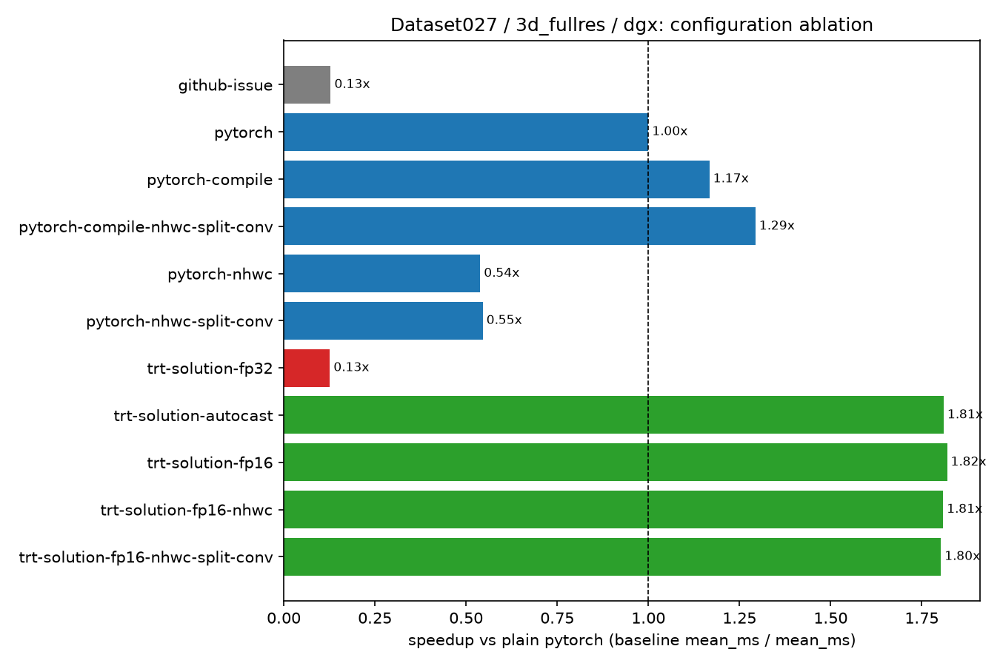
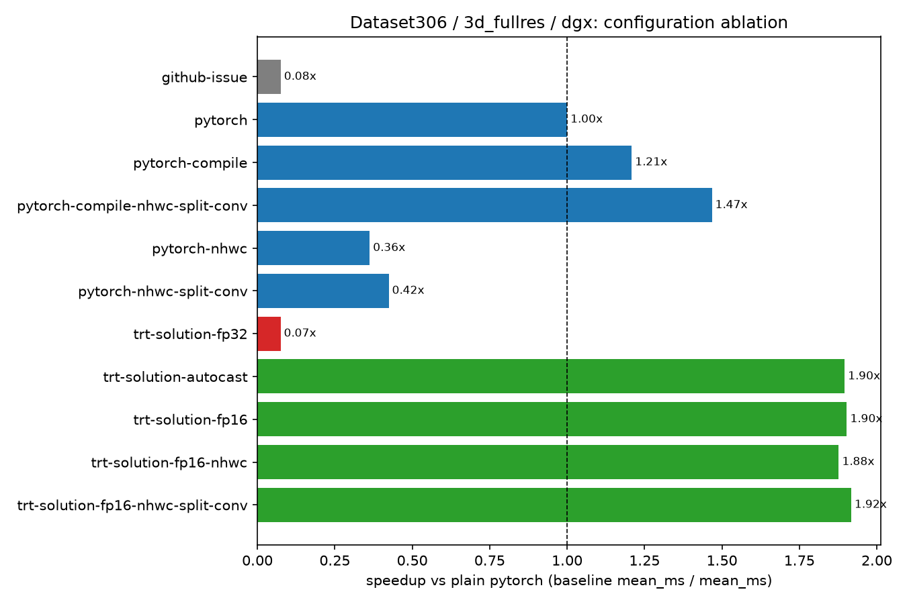
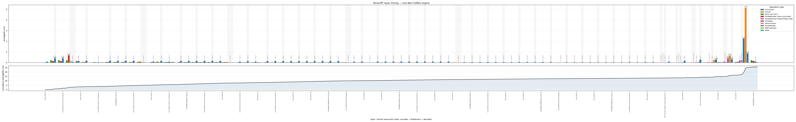
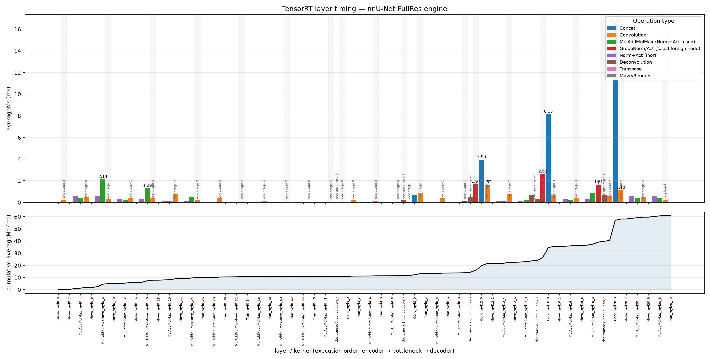
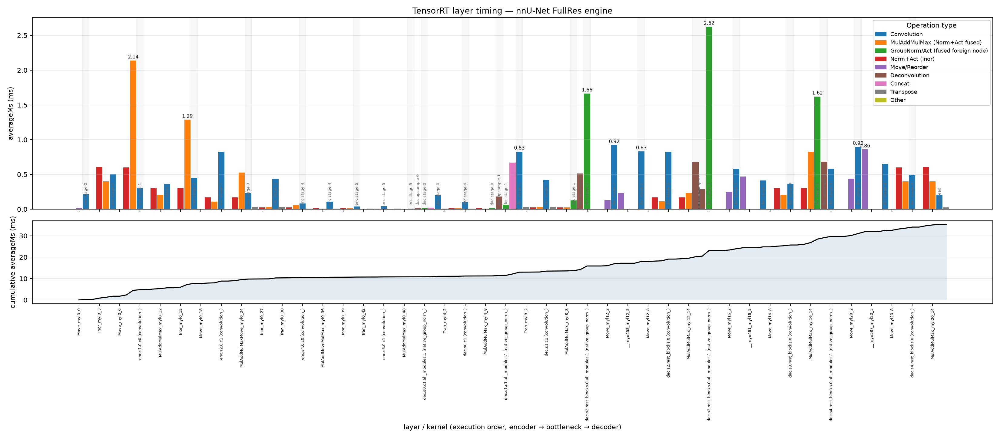

# Issue answer
[issue](https://github.com/MIC-DKFZ/nnUNet/issues/2706)

Hello, it is difficult to reproduce the exact issue as I don't know which model configuration, GPU model, and library versions you're using.

Nonetheless, as pointed out by the NVIDIA TensorRT documentation, the main performance bottleneck during inference is precision ([docs](https://docs.pytorch.org/TensorRT/user_guide/performance_tuning.html#using-the-right-precision)). From what I can see, you used `input = torch.randn((1, 5, 20, 320, 256)).cuda()`; of course this is the dummy input, but it reflects the issue you might be having in your source code. By default, `torch.randn` generates a tensor of precision `torch.float32`, and the nnUNet-created model is also `torch.float32`. Given this, even if you set the `enabled_precisions` option to use `half` and `float`, if the model and example input are FP32, simply allowing FP16 and FP32 through `enabled_precisions` does not by itself guarantee that the resulting graph will reproduce nnUNet's mixed-precision execution. In particular, with the strong-typing behavior used by recent Torch-TensorRT/TensorRT versions, lower-precision execution needs to be explicitly represented and TensorRT will endup creating an engine that keeps this precision in the generated kernels, expected inputs, and generated outputs. To check if that's your case, simply add `dryrun=True` to `torch_tensorrt.compile()` and inspect whether every inner operation is performed in fp32 precision.

And, answering the original question: in such case, the generated engine is slower because during inference `nnUNet` uses autocast ([here](https://github.com/MIC-DKFZ/nnUNet/blob/master/nnunetv2/inference/predict_from_raw_data.py#L681)) whenever possible, effectively working in `torch.half` most of the time, which will inevitably outperform a TensorRT fp32 engine.

```python
    @torch.inference_mode()
    def predict_sliding_window_return_logits(self, input_image: torch.Tensor) \
            -> Union[np.ndarray, torch.Tensor]:
        [. . .]
        with torch.autocast(self.device.type, enabled=True) if self.device.type == 'cuda' else dummy_context():
            [. . .]
```

The plot below shows exactly this: `github-issue` (the reported setup) and `trt-solution-fp32` (forcing compilation to work only with precision fp32) sit roughly an order of magnitude above every other configuration, because both are effectively running fp32 under the hood.



## Proposed Solution

This is the easiest solution I could find, and it best aligns with nnUNet's "avoid complexity" philosophy: enable autocast during compilation to mimic `nnUNetPredictor`'s behavior and get the same precision. (It would be preferable to control the precision exactly by setting it to fp16, but we can keep it general to all GPUs in case the compiler detects during autocasting that fp16 is actually a bad option.) The `require_full_compilation` flag is useful to avoid silent graph breaks; for now, all nnUNet configurations are fully covered by TensorRT anyways.

- **compile and export**
```python
trt_gm = torch_tensorrt.compile(
    network,
    ir="dynamo",
    inputs=[input_data],
    backend="torch_tensorrt",
    dynamic=False,
    enable_autocast=True,
    autocast_low_precision_type=torch.float16,
    require_full_compilation=True,
)

torch_tensorrt.save(trt_gm, output_filepath, inputs=[input_data])
```

- **loading**
```python
network = torch.export.load(output_filepath).module()
```

### Results summary

Sadly, autocast TensorRT is not always the fastest option, in several configurations it's actually beaten by plain `torch.compile` (see below):



## Caveats

TensorRT is an actively developed project, and some operations aren't yet perfectly optimized by the compiler. I'm talking specifically about skip connections. At least from what I've been able to find, TensorRT doesn't have a specific way of optimizing skip connections as a whole. Meaning: in a UNet model, TensorRT optimizes `encoder -> bottleneck -> decoder` in order and independently, so the optimal policy for the encoder might not align with the decoder's (and in my experiments, it did not). For increasingly larger inputs, performance ends up heavily dominated by memory bandwidth during the skip connections' `torch.cat` operations, plus unnecessary reformatting and moves of the skipped features to match the decoder's upcoming features (NHWC-type format, etc.). These operations clearly don't scale well, and cause models with large input sizes compiled with TensorRT to perform worse than plain PyTorch (unless the GPU architecture bandwidth is good enough to tolerate this as in the case of DGX GB100, it would be interesting to test in A100, etc).

One workaround, until the TensorRT compiler gets smarter about this, would be to replace the costly concatenation of the two tensors followed by a convolution, with the sum of two properly configured partial convolutions (mathematically equivalent, no retraining needed):
$$conv(cat(features, skips)) = conv1(features) + conv2(skips)$$
But then again, this introduces the overhead of more kernel launches, and while it performs better than plain eager PyTorch, this custom TensorRT solution is often still slower than the simpler `torch.compile(network)` for these large input tensors.

## Experiments

As this topic aligns with my thesis, I performed some experiments to check. In particular, I benchmarked a single forward pass of the model (eager mode, `torch.compile`, TensorRT, etc.) on 3 available GPUs and 2 datasets: one public, and our private one.
### Setup

| Specification  | DGX Spark   | A40        | L40S        |
| -------------- | ----------- | ---------- | ----------- |
| GPU            | NVIDIA GB10 | NVIDIA A40 | NVIDIA L40S |
| Driver         | 580.173.02  | 595.71.05  | 575.57.08   |
| CUDA           | 13.0        | 13.2       | 12.9        |
| Python         | 3.12.3      | 3.12.12    | 3.12        |
| PyTorch        | 2.13.0      | 2.13.0     | 2.8.0       |
| TensorRT       | 11.0.0.114  | 11.0.0.114 | —           |
| Torch-TensorRT | 2.13        | 2.13.0     | 2.8.0+cu129 |
| nnUNet         | 0e49508     | 0e49508    | 0e49508     |

### Datasets
# Dataset and Model Configuration Specifications

- Automated Cardiac Diagnosis Challenge (ACDC) — [kaggle](https://www.kaggle.com/datasets/anhoangvo/acdc-dataset/data)
        - Tested with configurations 2d and 3d_fullres, planner: `nnUNetPlannerResEncL`
    - 2D configuration patch size: `(256, 10)`
    - 3D_fullres configuration patch size: `(256, 256, 10)`
    
- Bone tumor segmentation (private dataset), labels: 0 = background, 1 = tumor, CT scans of `(N, 512, 512)`. Used an old model trained on `nnUNetPlans`, no residual encoder.
    - 2D configuration patch size: `(512, 512)`
    - 3D_fullres configuration patch size: `(48, 192, 192)`
## Results

### 1. 2D configuration

**ACDC (Dataset027)**

TensorRT compiled engine performs really well for 2d as the task is compute-bound and not really bandwidth bound the fused kernels and other optimizations dominate over `torch.compile` (patch size of ~ 5.1 KB for fp16)





**BONES (Dataset306)**

Again we see some improvements by using tensorRT but the larger input size already appears (patch size ~ 0.5 MB) particularly bad for L40S





### 2. 3D_fullres configuration

**ACDC (Dataset027)**

`torch.compile` is better for GPUs with worst bandwidth where the bad compilation of skip connections effect dominates. 





**BONES (Dataset306)**




### 3. TensorRT explosion on 3D_fullres skip connections

Skip-connection concatenation becomes a bottleneck on larger inputs. Below is the profiling evidence on the A40.

**Dataset027 dataset, 3D fullres**


**Dataset306 Bone tumor dataset, 3D fullres**


**Naive solution** Bone tumor dataset, 3D fullres, replacing concatenation with two convolutions:


## Misc Comments

TensorRT offers some parameters to tune the final compiled engine:
- tiling: recommended for convolution-intensive networks
- workspace
- aux streams
- ...

but in order to keep nnUNet's simplicity philosophy, I believe enabling autocast as the only setting clearly provides all the benefit without introducing the hassle of adapting the compilation to every possible GPU model a user might have.


# TensorRT deployment-2706

Reproducing and fixing TensorRT issue.

## Reproducibility

```
module load python/3.12.12

python -m venv ...

activate ...

pip install torch==2.13.0 torchvision==0.28.0 --index-url https://download.pytorch.org/whl/cu132
pip install torch-tensorrt  torchinfo 

git submodule add git@github.com:MIC-DKFZ/nnUNet.git external/nnUNet
cd external/nnUNet
git checkout 0e49508

git submodule update --init --recursive

cd nnUNet
pip install -e .

# if dataset not processed
export nnUNet_raw="/home/maxrodri/Datasets/nnunet_raw"
export nnUNet_preprocessed="/home/maxrodri/Datasets/nnunet_preprocessed"
export nnUNet_results="/home/maxrodri/Datasets/nnunet_results"

nnUNetv2_plan_and_preprocess -d 027 -pl nnUNetPlannerResEncL

# to run all, example:
python run_all.py --nnunet-preprocessed /home/maxrodri/Datasets/nnunet_preprocessed/Dataset306_BONE_TUMOR_EXTENDED --plans-filename "nnUNetPlans.json" --results-dir ./dgx-bone-all-configs --dataset-name Dataset306_BONE_TUMOR_EXTENDED
python run_all.py --nnunet-preprocessed /home/maxrodri/Datasets/nnunet_preprocessed/Dataset027_ACDC --plans-filename "nnUNetResEncUNetLPlans.json" --results-dir ./dgx-bone-all-configs --dataset-name Dataset306_BONE_TUMOR_EXTENDED
```

## Nsight kernel time stats
```bash
nsys profile \                                                                  
   --trace=cuda,nvtx,cudnn,cublas,osrt \                                         
   --pytorch=autograd-shapes-nvtx \                                              
   --python-backtrace=cuda \                                                     
   --python-sampling=true \                                                      
   --force-overwrite=true \                                                      
   -o ./profiling/nsys- \                                   
   python ....py 
   
nsys stats \                                                                    
  --report cuda_gpu_kern_sum \                                                  
  --force-export=true \                                                         
  "$OUTPUT_DIR/....nsys-rep" \                             
  > "$OUTPUT_DIR/..._kernels.txt"
```

chmod +x profile_experiment.sh   # already done, but just in case
./profile_experiment.sh 2d trt-solution -- \
    --dataset-name Dataset306_BONE_TUMOR_EXTENDED \
    --nnunet-preprocessed /home/maxrodri/Datasets/nnunet_preprocessed/Dataset306_BONE_TUMOR_EXTENDED \
    --plans-filename nnUNetPlans.json \
    --compiled-engines-dir ./Dataset306_BONE_TUMOR_EXTENDED

## Worth to try
- `use_fast_partioner` default is True, hence the fastest partion found might not be the optimal choice globally
- `num_avg_timing_iters` deafult is 1, increase for stability reasons?
- `max_aux_streams` default is None, max allowed TRT streams per engine, don't understand this one
- `truncate_double` default is Falsea
- `tiling_optimization_level` default is None,  [“none”, “fast”, “moderate”, “full”]
    - Tiling can substantially improve throughput for convolution-heavy models.
- `require_full_compilation` set to True correctness gate as nnUNet is currently fully TRT-compatible

## Profiling wiht trtExec
```bash
python compile_and_save.py \
    --dataset-name Dataset027_ACDC \
    --nnunet-preprocessed /lustre/uc3m_a0/dynamic/maxrodri/datasets/nnUNet/nnUNet_preprocessed/Dataset027_ACDC \
    --plans-filename nnUNetResEncUNetLPlans.json \
    --mode trt-solution-autocast --configurations 3d_fullres \
    --export-raw-engine

trtexec --loadEngine=Dataset027_ACDC/ \
        --iterations=50 --avgRuns=50 \
        --profilingVerbosity=detailed \
        --dumpProfile --exportProfile=a40_fullres_profile.json
```
